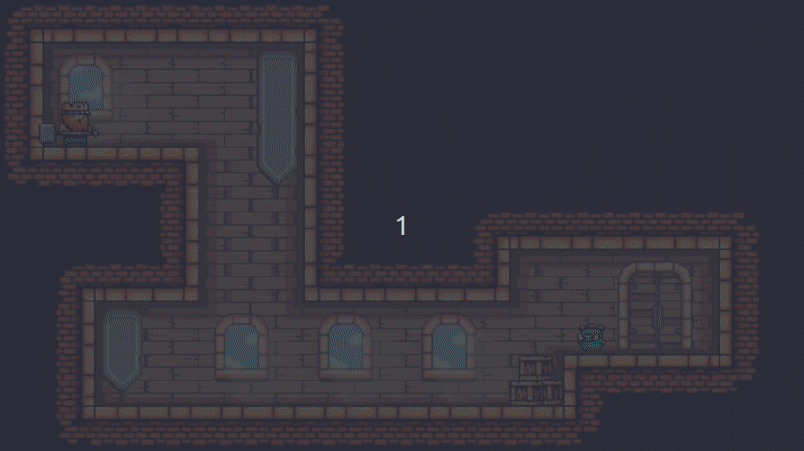

# Platformer Game
## Small platformer game coded in JavaScript
### Key features:
- HTML Canvas - allows to draw graphics inside a HTML page
- Object Oriented Programming
- Gravity
- Collision detection on environment
- Movement
- Animation
- Changing levels
- Entering doors
- Collision detection on enemies
- Diamond collection
- Enemy hitpoints
- Random animation times
- Attack animation
- Enemy movements jump / run / attack



Play the game: https://alexisraspberry.duckdns.org/kings-and-pigs/

## Running tests

```
npm test
```

The unit tests need Node 22 or newer (`engines.node` in `package.json`). There are no dependencies to install. GitHub Actions runs the same command on Node 22 for every push to `main` and every pull request.
